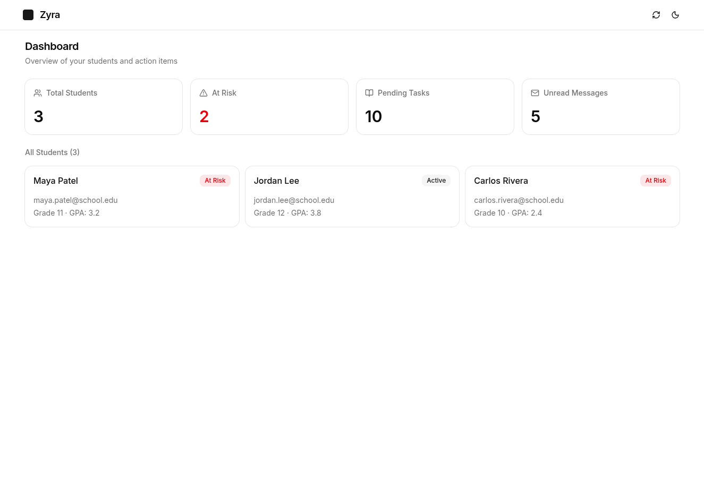
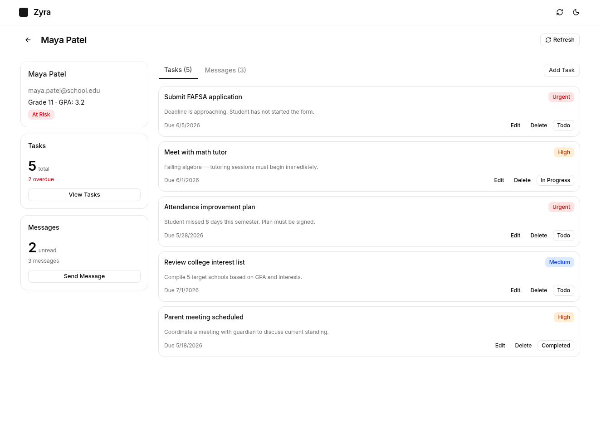
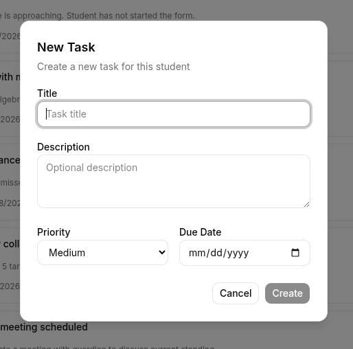

# Zyra — Counselor Student Action Center

> **Live demo:** [https://zyra-assignment.onrender.com](https://zyra-assignment.onrender.com)

A full-stack platform for counselors to manage student tasks, track action items, and monitor at-risk students.

## Tech Stack

| Layer    | Technology                                                                   |
| -------- | ---------------------------------------------------------------------------- |
| Runtime  | **Bun** (package manager + runtime)                                          |
| Monorepo | Native npm workspaces                                                        |
| Frontend | **React 19**, **Vite 8**, **TypeScript**, **Tailwind CSS v4**, **shadcn/ui** |
| State    | **Zustand** (client state), custom fetcher (API layer)                       |
| Backend  | **Express**, **Mongoose**, **Pino** (logging)                                |
| Database | **MongoDB**                                                                  |
| Testing  | **Vitest**, **supertest**, **Testing Library**                               |
| Shared   | `@zyra-ass/shared` — common TypeScript types                                 |

---

## Screenshots

| Dashboard                          | Student Details                                | Task Form                          |
| ---------------------------------- | ---------------------------------------------- | ---------------------------------- |
|  |  |  |

> The app includes a **light/dark theme toggle** in the top header.

---

## Setup & Run

### Prerequisites

- [Bun](https://bun.sh/) >= 1.3
- MongoDB instance (local or Atlas)

### 1. Clone & install

```bash
git clone <repo-url>
cd zyra-ass
bun install
```

### 2. Configure environment

```bash
cp backend/.env.example backend/.env
```

Edit `backend/.env`:

```env
PORT=8000
MONGODB_URI=mongodb+srv://<user>:<pass>@<host>/zyra-ass
MONGODB_URI_TEST=mongodb+srv://<user>:<pass>@<host>/zyra-ass-test
```

### 3. Seed the database

```bash
bun run --cwd backend seed
```

This populates the database with mock students, tasks, and messages.

### 4. Start development

```bash
# Run both backend + frontend concurrently
bun run dev

# Or separately:
bun run dev:backend   # Express API on :8000
bun run dev:frontend  # Vite dev server on :5173 (proxies /api to :8000)
```

The frontend dev server proxies `/api/*` to `http://localhost:8000` so you access the app at `http://localhost:5173`.

---

## Project Structure

```
zyra-ass/
├── packages/
│   └── shared/              # Shared TypeScript types
│       └── src/types.ts     # Student, Task, Message, ApiResponse, etc.
├── backend/
│   ├── server.ts            # Entry point: connect DB + start Express
│   ├── app.ts               # Express app (middleware, routes, error handler)
│   ├── constants/envvars.ts # Environment variables
│   ├── mock_data.ts         # Seed script + exported mock data arrays
│   ├── lib/
│   │   ├── db.ts            # MongoDB connection helper
│   │   ├── counter.ts       # Auto-increment ID generator (stu_001, tsk_001)
│   │   ├── asyncHandler.ts  # Controller wrapper (catch + ApiResponse envelope)
│   │   ├── errorHandler.ts  # Global Express error middleware
│   │   ├── logger.ts        # Pino logger
│   │   └── requestId.ts     # UUID per request
│   ├── models/              # Mongoose schemas (Student, Task, Message)
│   ├── controllers/         # Route handlers
│   ├── routes/              # Express routers
│   └── __tests__/           # Integration tests
├── frontend/
│   └── src/
│       ├── lib/fetcher.ts    # API client (fetch wrapper, type unwrapping)
│       ├── store/            # Zustand stores (dashboard, action-center, theme)
│       ├── pages/            # Route pages (dashboard, student detail)
│       ├── components/       # React components (task-card, message-list, etc.)
│       ├── providers/        # Context providers (theme, tooltip)
│       └── router.tsx        # Route definitions
```

## Architecture

### Frontend — Data Flow

```
Pages → Zustand Store (useDashboardStore / useActionCenterStore)
         → fetcher.ts (wraps fetch, unwraps ApiResponse envelope)
         → /api/v1/* endpoints (proxied by Vite)
```

**State management:** Two Zustand stores own API data. The dashboard store fetches summary counts + student list. The action-center store manages per-student tasks and messages. Mutations use optimistic updates — local state changes immediately, rolls back on error.

**No React Query** was used. Zustand + a thin fetch wrapper keeps the dependency count low. For a production app with aggressive caching, React Query would be the recommended addition.

### Backend — Layered Architecture

```
routes/*.ts → controllers/*.ts → models/*.ts (Mongoose) → MongoDB

Middleware pipeline:
  cors() → express.json() → requestId → requestLogger → routes → errorHandler
```

Every controller returns a standardized `ApiResponse<T>` envelope:

```ts
{
    status: number
    message: string
    data: T | null
    error: string | null
}
```

### Shared Types

The `@zyra-ass/shared` package contains all entity types and API contracts. Both frontend and backend import from it, ensuring type consistency across the stack.

---

## API Contract

All endpoints are prefixed with `/api/v1` and return the same envelope:

```jsonc
// Success
{ "status": 200, "message": "…", "data": { … }, "error": null }

// Error
{ "status": 404, "message": "…", "data": null, "error": "Not found" }
```

### Dashboard

| Method | Endpoint             | Description       | Response `data`                                                |
| ------ | -------------------- | ----------------- | -------------------------------------------------------------- |
| `GET`  | `/dashboard/summary` | Aggregated counts | `{ totalStudents, atRiskCount, pendingTasks, unreadMessages }` |

### Students

| Method   | Endpoint                        | Description                    | Response `data`                           |
| -------- | ------------------------------- | ------------------------------ | ----------------------------------------- |
| `GET`    | `/students`                     | List all students              | `Student[]`                               |
| `GET`    | `/students/:id`                 | Single student                 | `Student`                                 |
| `GET`    | `/students/:id/action-center`   | Student + tasks + unread count | `{ student, tasks, unreadMessagesCount }` |
| `GET`    | `/students/:studentId/tasks`    | Tasks for a student            | `Task[]`                                  |
| `GET`    | `/students/:studentId/messages` | Messages for a student         | `Message[]`                               |
| `POST`   | `/students`                     | Create student                 | `Student`                                 |
| `PATCH`  | `/students/:id`                 | Update student                 | `Student`                                 |
| `DELETE` | `/students/:id`                 | Delete student                 | `null`                                    |

### Tasks

| Method   | Endpoint                | Description        | Response `data` |
| -------- | ----------------------- | ------------------ | --------------- |
| `GET`    | `/tasks`                | List all tasks     | `Task[]`        |
| `GET`    | `/tasks/:id`            | Single task        | `Task`          |
| `POST`   | `/tasks`                | Create task        | `Task`          |
| `PATCH`  | `/tasks/:id`            | Update task        | `Task`          |
| `PATCH`  | `/tasks/:taskId/status` | Update status only | `Task`          |
| `DELETE` | `/tasks/:id`            | Delete task        | `null`          |

### Messages

| Method   | Endpoint        | Description       | Response `data` |
| -------- | --------------- | ----------------- | --------------- |
| `GET`    | `/messages`     | List all messages | `Message[]`     |
| `GET`    | `/messages/:id` | Single message    | `Message`       |
| `POST`   | `/messages`     | Create message    | `Message`       |
| `PATCH`  | `/messages/:id` | Update message    | `Message`       |
| `DELETE` | `/messages/:id` | Delete message    | `null`          |

### Key Types

```ts
interface Student {
    id: string // "stu_001"
    name: string
    email: string
    grade: number
    gpa: number
    counselorId: string
    enrollmentStatus: "at_risk" | "active"
}

interface Task {
    id: string // "tsk_001"
    studentId: string
    title: string
    description: string
    status: "todo" | "in_progress" | "completed"
    priority: "urgent" | "high" | "medium" | "low"
    dueDate: string
    createdAt: string
    updatedAt: string
}

interface Message {
    id: string // "msg_001"
    studentId: string
    from: string
    subject: string
    preview: string
    read: boolean
    receivedAt: string
}
```

---

## Performance Decisions & Tradeoffs

### 1. Dashboard Summary — Parallel Counts

**Problem:** The dashboard page initially made 3 API calls (`GET /students`, `GET /tasks`, `GET /messages`) that transferred entire collections just to display 4 summary counts.

**Solution:** A dedicated `GET /dashboard/summary` endpoint runs 4 `countDocuments` queries in parallel via `Promise.all`:

```ts
const [total, atRisk, pending, unread] = await Promise.all([
    StudentModel.countDocuments(),
    StudentModel.countDocuments({ enrollmentStatus: "at_risk" }),
    TaskModel.countDocuments({ status: { $ne: "completed" } }),
    MessageModel.countDocuments({ read: false }),
])
```

Each query hits an indexed field and returns a single integer. This is the most efficient approach for simple counts — MongoDB's `countDocuments` uses collection metadata and the queries are trivially parallelizable across collections.

**Tradeoff:** 4 database round-trips vs. a single aggregation pipeline with `$lookup`. For simple counts on indexed fields, 4 lightweight `countDocuments` calls are faster and more maintainable than a cross-collection `$lookup` aggregation. The overhead of an extra round-trip is negligible compared to the complexity and brittleness of `$facet` + `$lookup`.

| Approach                             | DB round-trips | Code complexity | Works with sharded cluster | Handles empty collections  |
| ------------------------------------ | -------------- | --------------- | -------------------------- | -------------------------- |
| 4× `countDocuments`                  | 4              | Low             | Yes                        | Yes                        |
| Single `$facet` + `$lookup` pipeline | 1              | High            | No                         | Requires `$documents` seed |

The `countDocuments` approach is the right call here: simpler code, no edge cases, and `countDocuments` on indexed fields is already optimal.

### 2. Optimistic Updates

Task status changes, edits, deletes, and message reads update local Zustand state immediately before the API responds. On failure, state is rolled back and a toast error is shown.

**Tradeoff:** Optimistic updates make the UI feel instant but add complexity for error recovery. For operations that often fail (e.g., network-heavy mutations), pessimistic updates with loading spinners may be simpler.

### 3. No Caching Library

The app uses Zustand with manual fetch triggers rather than React Query / TanStack Query. There is no stale-while-revalidate, request deduplication, or automatic background refetching.

**Tradeoff:** Simpler setup and fewer dependencies. For a production app with many users and frequent data changes, adding React Query would provide:

- Automatic cache invalidation after mutations
- Request deduplication (same URL in-flight coalesced)
- Background refetching on tab focus
- Simplified loading/error state management

### 4. No Pagination

List endpoints return all documents. This is acceptable for the mock dataset (~dozens of records) but would need pagination (`?page=&limit=`) for production scale.

---

## Test Output

### Frontend (12/12 passing)

```
$ bun run --cwd frontend test

 RUN  v3.2.4 /home/teleportu/work/zyra-ass/frontend

 ✓ src/components/__tests__/task-card.test.tsx (12 tests) 89ms

 Test Files  1 passed (1)
      Tests  12 passed (12)
   Start at  09:46:20
   Duration  1.94s
```

### Backend Integration Tests

Backend tests require a running MongoDB instance (configured via `MONGODB_URI_TEST` in `.env`). With MongoDB available:

```
$ bun run --cwd backend test

 RUN  v3.2.4 /home/teleportu/work/zyra-ass/backend

 ✓ __tests__/action-center.test.ts (5 tests) 10010ms

 Test Files  1 passed (1)
      Tests  5 passed (5)
```

The test suite covers:

- `GET /students/:id/action-center` — returns student, tasks, and unread message count
- `GET /students/:id/action-center` — returns 404 for unknown student
- `PATCH /tasks/:taskId/status` — updates task status
- `PATCH /tasks/:taskId/status` — rejects invalid status with 400
- `PATCH /tasks/:taskId/status` — returns 404 for unknown task
